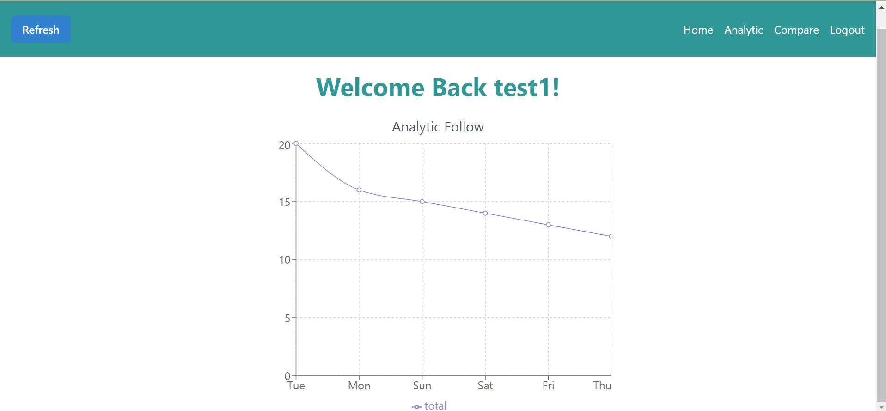
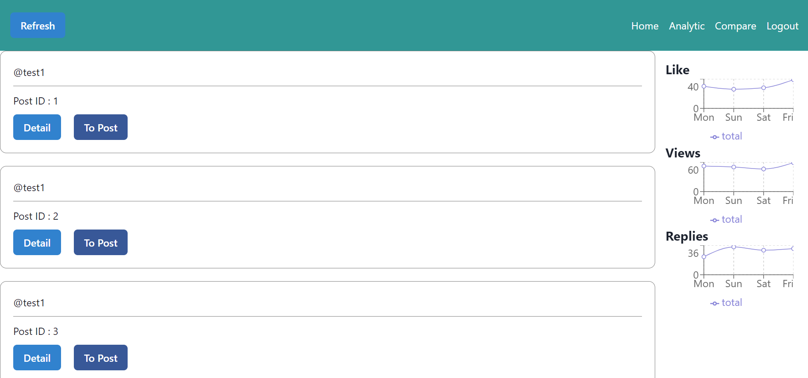
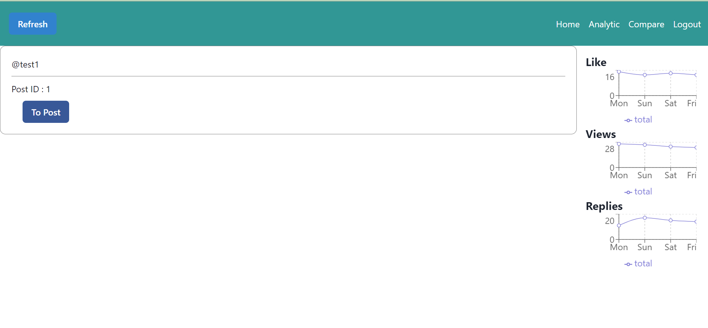
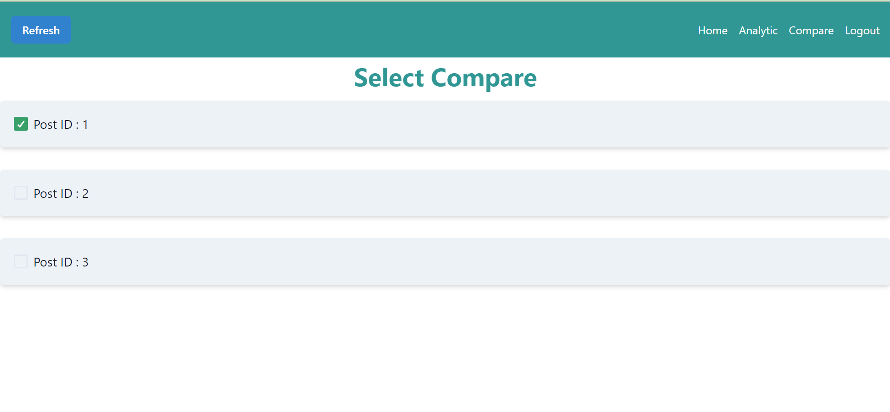
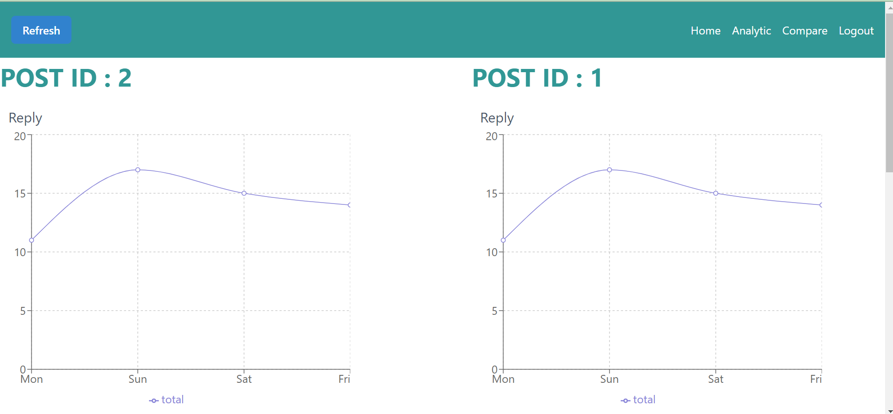

# Deskripsi Client SPA

SPA atau biasa disebut Single Page Application merupakan aplikasi berbasis web yang memiliki satu halaman. Satu halaman ini memiliki beberapa fitur yang bisa berjalan asinkronus. Kerena berjalan asinkronus, tiap fitur dapat berjalan sendiri tanpa menunggu fitur lain berjalan. 

Pada Client SPA yang kami buat merupakan aplikasi dashboard yang digunakan untuk melihat analitik dari berbagai data. Data data ini merupakan data user dari sebuah post pada hari tertentu, seperti like, replies, dan view. Untuk menampilkan dashboard hasil analitik dengan menggunakan chart untuk melihat perkembangan dari data data post dari 1 minggu kebelakang. Selain itu juga ada analitik follower yang digunakan untuk melihat pertemanan pada user pada 1 minggu kebelakang. Analitik dari post bisa dilihat secara data keseluruhan post ataupun tiap post. Selain itu, aplikasi dapat membandingkan dari 2 analitik post yang berbeda.

# Tampilan Layar

# Pembagian Tugas

 - Login Register (Sulthan Dzaky Alfaro 13521159)
 - Analitik Follower (Sulthan Dzaky Alfaro 13521159)
 - Analitik Keseluruhan Post (Sulthan Dzaky Alfaro 13521159)
 - Analitik Suatu Post (Sulthan Dzaky Alfaro 13521159)
 - Compare Analitik Post (Sulthan Dzaky Alfaro 13521159)