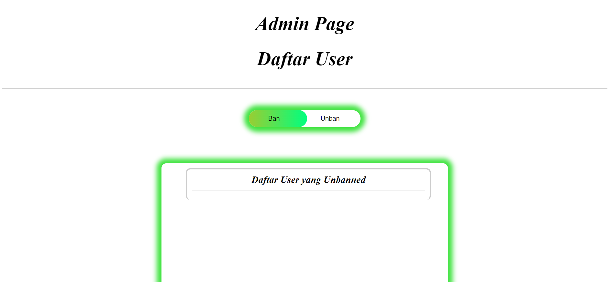

## Tugas Besar 1 IF3110 Pengembangan Aplikasi Berbasis Web

### Deskripsi Aplikasi Web

Aplikasi web ini merupakan aplikasi web yang digunakan untuk memudahkan pengguna dalam melakukan sesuatu. Selain itu beberapa aplikasi web juga dapat memberikan berbagai informasi. Web yang kami buat adalah web sosial media yang berisi postingan yang dapat berupa teks, video, gambar, ataupun audio. Dalam web ini pengguna dapat melakukan berbagai hal seperti membuat postingan, menghapus postingan, mengedit postingan, dan lain-lain. Selain itu pengguna juga dapat melihat postingan dari pengguna lain.

### Daftar Requirement

1. Pastikan sudah menginstall docker
2. Jika memungkinkan pastikan sudah menginstall WSL

### Cara Instalasi

1. Clone repository ini
2. Buka terminal dan arahkan ke folder repository yang telah di clone
3. Jika anda memiliki WSL, pertama anda harus menjalankan "bash scripts/build-image.sh" untuk membangun image docker
4. Jika anda tidak memiliki WSL, anda dapat menjalankan  "docker build -t tubes-1:latest ." untuk membangun image docker

### Cara Menjalankan Server

1. Jalankan "docker compose up" untuk menjalankan aplikasi tunggu container selesai dibangun
2. Setelah container selesai dibangun, buka browser dan akses "localhost:8008"

### Screenshot Tampilan Aplikasi

### Pembagian Tugas

Server Side:
- Home : Sulthan Dzaky Alfaro (13521159)
- Post : Johann Christian Kandani (13521138)
- Profile : Johann Christian Kandani (13521138)
- Login : Sulthan Dzaky Alfaro (13521159)
- Registrasi : Sulthan Dzaky Alfaro (13521159)
- Admin : Sulthan Dzaky Alfaro (13521159)

Client Side:
- Home : Fazel Ginanda (13521098), Sulthan Dzaky Alfaro (13521159)
- Post : Fazel Ginanda (13521098)
- Profile : Johann Christian Kandani (13521138)
- Login : Sulthan Dzaky Alfaro (13521159)
- Registrasi : Sulthan Dzaky Alfaro (13521159)
- Admin : Sulthan Dzaky Alfaro (13521159)

Tambahan:
Fitur Reply : Sulthan Dzaky Alfaro (13521159)
Like : Sulthan Dzaky Alfaro (13521159)

