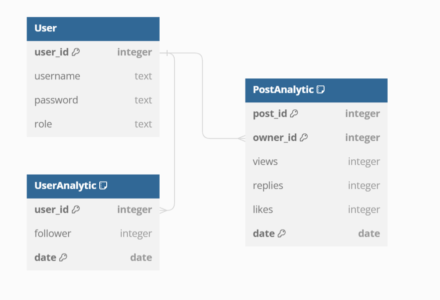

## REST

## Deskripsi REST 

REST API merupakan web service yang digunakan sebagai perantara pengambilan data/pengubahan data pada sebuah database yang terhubung dengan web service tersebut. REST API ini dibuat menggunakan bahasa pemrograman TypeScript dengan framework ExpressJS. Database yang digunakan adalah Postgresql. REST ini akan digunakan untuk komunikasi antara Client SPA dengan database/SOAP/PHP Application. 

## Skema Basis Data

Skema basis data yang digunakan dapat dilihat pada diagram di bawah ini.

## Endpoint API

REST menyediakan Endpoint API untuk mengakses data-data statistik dari PHP App untuk dianalisis dan divisualisasikan dalam bentuk grafik.

## Pembagian Tugas

Backend REST: 13521138, 13521159