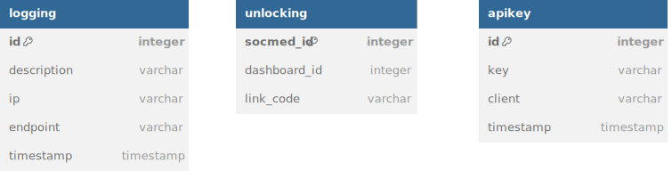

# SOAP Service

## Deskripsi 

SOAP Service adalah web service yang menyediakan layanan komunikasi antara PHP App dan REST Service. SOAP memiliki entitas unlocking yang menyimpan relasi antara akun PHP dengan akun REST. SOAP dapat dipanggil dengan API Key yang unik untuk setiap client-nya.

## Skema Basis Data

Skema basis data yang digunakan dapat dilihat pada ERD berikut.

## Endpoint API

Web service unlocking di-deploy pada URL `localhost:3003/ws/unlocking`. Sementara itu, WSDL dari web service yang memanfaatkan SOAP ini di-deploy pada `localhost:3003/ws/unlocking?wsdl`. Terdapat dua method utama yang disediakan pada endpoint ini yaitu requestUnlocking dan verifyUnlocking. Method requestUnlocking dimanfaatkan oleh PHP App untuk membuka layanan dashboard. Method verifyUnlocking dimanfaatkan oleh REST untuk memeriksa apakah akun yang akan mendaftar di Dashboard sudah berhak untuk menikmati fitur tersebut.

## Pembagian Tugas

Handler Authentication: 13521098
Handler Logging: 13521098
Handler Config: 13521138
Database: 13521098, 13521138
Endpoint Unlocking: 13521098, 13521138
Docker Config dan Setup: 13521138